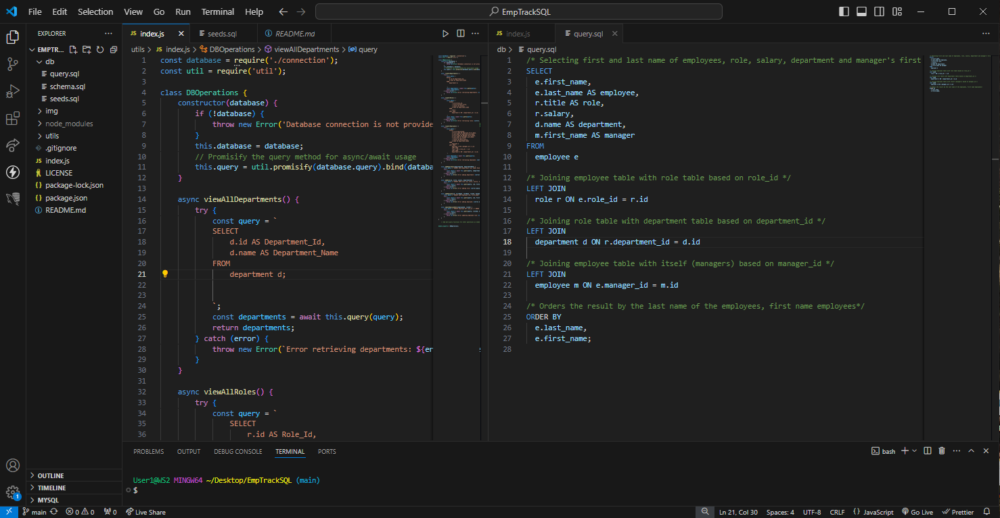

# EmpTrackSQL
A command-line application which manages a company's employee database, using Node.js, Inquirer, and MySQL.

  ## Screenshot
  

  ## Links to video
  [](https://youtu.be/bDy5vKpaask)


  ## Description
  This application accepts user input to view all departments, roles, employees, add a department, role, or employee, as well as updating an employee role.
  By utilizing MySQL2 and Inquirer packages, the app allows the user to interact via the command line to view, create and update the information within/from the database:
  Viewing all departments presents a table showing department names and Id's.
  Viewing all roles presents job title, role id, department the role belongs to and the salary for the role.
  Viewing all employees presents a table showing employee id's, first and last names, job titles, departments, salaries, and managers the employee reports to.
  Adding a department, role and employee are also functions that are applicable and prompted by questions to input the data using inquirer.

\
  
  ## Table of Contents
  - [Installation](#installation)
  - [Usage](#usage)
  - [Licence](#license)
  - [Contributing](#contributing)
  - [Tests](#tests)
  - [Questions](#questions)
  
  ## Installation
  ``` bash
  npm i  
  node index.js
  ```
  
  ## Usage
  This application uses the Inquirer package as well as the MySQL2 package to connect to a MySQL database.
  
  ## License
    This project is licenced under the MIT license.
  [license](https://opensource.org/licenses/MIT)

  ## Contributing
  Contact Me

  ## Tests
  No test

  ## Questions
  If you have any questions I may or comments, be contacted at [GitHub](cdepalma32), or by [email](crystaldepalma@yahoo.com).